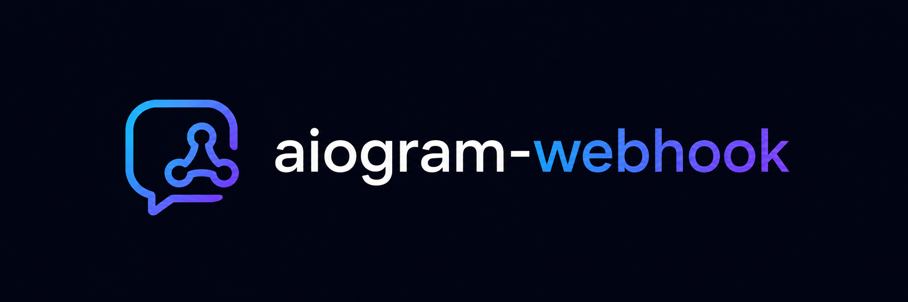

# aiogram-webhook
[](https://pypi.org/project/aiogram-webhook)
[](https://codecov.io/github/m-xim/aiogram-webhook)
[](https://github.com/m-xim/aiogram-webhook/actions)
[](/LICENSE)
[](https://deepwiki.com/m-xim/aiogram-webhook)
[](https://github.com/astral-sh/ruff)
[](https://github.com/astral-sh/ty)

`aiogram-webhook` is a modular Python library for webhook integration in aiogram.
It supports single-bot and token-based multi-bot setups, with route building, optional request checks, and adapters for FastAPI and aiohttp.

## Install

```bash
pip install aiogram-webhook
pip install "aiogram-webhook[fastapi]"
pip install "aiogram-webhook[aiohttp]"
```

## Quick Start

```python
from aiogram import Bot, Dispatcher
from fastapi import FastAPI

from aiogram_webhook import FastAPIAdapter, SingleBotEngine
from aiogram_webhook.route import Route

dispatcher = Dispatcher()
bot = Bot("BOT_TOKEN")

engine = SingleBotEngine(
    dispatcher,
    bot,
    web=FastAPIAdapter(),
    route=Route(base_url="https://example.com", path="/webhook"),
)

app = FastAPI()
engine.register(app)
```

Call `await engine.set_webhook()` during your application startup to register the public webhook URL in Telegram.
For production, pass `security=Security(...)` to verify Telegram requests.

## Documentation

The full documentation is in [`docs`](https://aiogram-webhook.m-xim.ru). It covers installation, FastAPI and aiohttp setup, routing, security, lifecycle behavior, and the public API.
