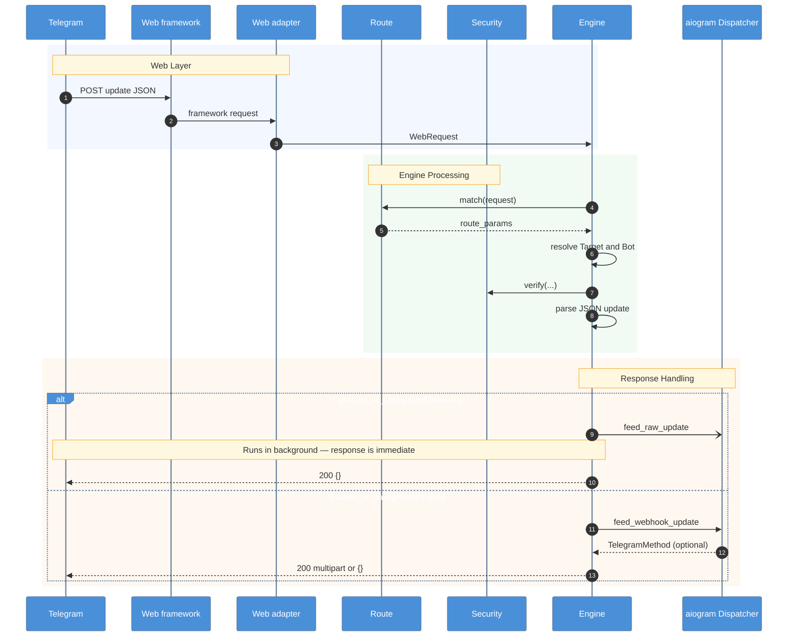

```mermaid
%%{
  init: {
    'theme': 'base',
    'themeVariables': {
      'primaryColor': '#4A90D9',
      'secondaryColor': '#E8F0FE',
      'noteBkgColor': '#FFF8E1',
      'noteBorderColor': '#F9A825',
      'activationBkgColor': '#D6E8FF',
      'actorTextColor': '#ffffff'
    }
  }
}%%
sequenceDiagram
    autonumber
    participant TG as Telegram
    participant FW as Web framework
    participant AD as Web adapter
    participant RT as Route
    participant SEC as Security
    participant EN as Engine
    participant DP as aiogram Dispatcher

    rect rgba(100, 150, 255, 0.08)
        note over TG,AD: Web Layer
        TG->>FW: POST update JSON
        FW->>AD: framework request
        AD->>EN: WebRequest
    end

    rect rgba(80, 200, 120, 0.08)
        note over RT,SEC: Engine Processing
        EN->>RT: match(request)
        RT-->>EN: route_params
        EN->>EN: resolve Target and Bot
        EN->>SEC: verify(...)
        EN->>EN: parse JSON update
    end

    rect rgba(255, 160, 80, 0.08)
        note over EN,DP: Response Handling
        alt handle_in_background (default)
            EN-)DP: feed_raw_update
            Note over EN,TG: Runs in background — response is immediate
            EN-->>TG: 200 {}
        else handle_in_background=False
            EN->>DP: feed_webhook_update
            DP-->>EN: TelegramMethod (optional)
            EN-->>TG: 200 multipart or {}
        end
    end
```

By default the HTTP response is an empty `200` while handlers run in the background. User-facing replies go through the Bot API in a separate call — not inside the webhook body.
